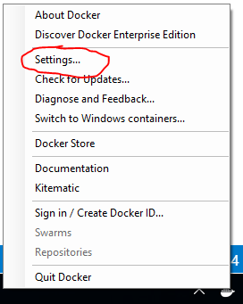
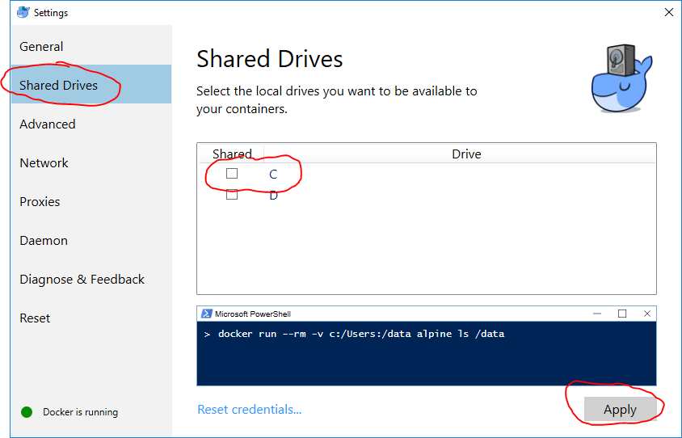
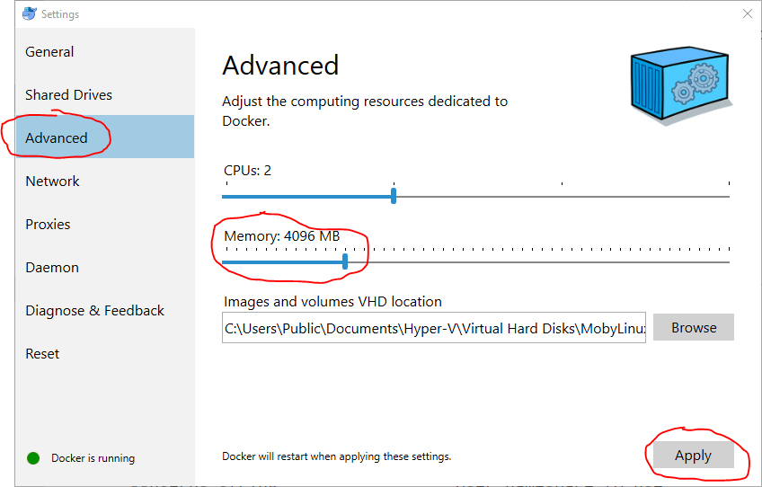

# Docker for Developers

## Docker Installation and Configuration

### Install Docker for Windows
  - https://www.docker.com/docker-windows

### Configure Docker for Windows

We are configuring Shared Drives for Linux Containers. This is so that we can share files between our machine and the container. This is used for later demos and is required if using Visual Studio extensions for Docker. We are also increasing the RAM of the Linux VM that Docker maintains. The increased RAM is required by the SQL Server for Linux container.

  - Right-click on Docker in Taskbar
     
     
  - Click Settings item in menu, make sure you see the text _Switch to Windows containers..._, this means you are currently running Linux containers, which is what we need.

     
  - Enable volume sharing, this is the Shared Drives setting

      
  - Increase memory used by Linux VM that Docker creates up to at least 4 GB
      

## Run Wrk (very simple load testing tool)

Wrk is a simple open source load testing tool. https://github.com/wg/wrk But it only works on Linux and requires you to compile it yourself with a C compiler (ugh!). Or we can run it from a Docker container.

Let's load test my blog with a single command from a Docker container. First, let's learn about wrk even though it's in a container:

```
docker run --rm skandyla/wrk --help
```
The command line option (--rm) says to remove the container after it is done executing. The skandyla/wrk is the name of the image that we are using from Docker Hub, https://hub.docker.com/r/skandyla/wrk/. It will be fetched locally if we don't already have it. The run command will create a container from an image, in our case the skandyla/wrk image. The commands after skandyla/wrk will be passed to the command running inside the container, in this case the wrk command-line tool will receive the --help argument. You should see output similar to the following:

```
Usage: wrk <options> <url>
  Options:
    -c, --connections <N>  Connections to keep open
    -d, --duration    <T>  Duration of test
    -t, --threads     <N>  Number of threads to use

    -s, --script      <S>  Load Lua script file
    -H, --header      <H>  Add header to request
        --latency          Print latency statistics
        --timeout     <T>  Socket/request timeout
    -v, --version          Print version details

  Numeric arguments may include a SI unit (1k, 1M, 1G)
  Time arguments may include a time unit (2s, 2m, 2h)
```

Now, let's load test my blog with this command:
```
docker run --rm skandyla/wrk -t5 -c5 -d10s  https://itsnull.com/
```

As you see the arguments we pass have the following meaning:

```
  -t5 (use 5 threads)
  -c5 (keep 5 connections open)
  -d10s (run for 10 seconds)
  https://itsnull.com (the url to load test)
```
No need to install Linux, C compiler, manually compile it, log into a Linux machine, etc. Just run it.

## Run locust (more advanced load testing tool)
Locust, https://locust.io/ is a Python based tool where you can model a user's behavior across your site including the pauses the user takes and then simulate a given number of users.

It requires you install Python, then some Python packages and possibly compile some packages natively for your platform by installing a C++ compiler (ugh!). Or we can build our own Docker container that does that. I've cobbled together a Dockerfile in the LocustContainer folder. It will build a new image based upon Alpine Linux and it installs a number of packages into the image, including Python and the locust packages. So, first we need to build this image on our machine.

```
cd LocustContainer
docker build -t trinug-locustio .
```

Building the image will take a few minutes and you should see messages like the following:
```
Sending build context to Docker daemon  2.048kB
Step 1/7 : FROM alpine:3.2
 ---> f797d6d09a3d
Step 2/7 : RUN apk -U add ca-certificates python python-dev py-pip build-base &&     pip install locustio pyzmq &&     apk del python-dev &&     rm -r /var/cache/apk/* &&     mkdir /locust
 ---> Running in 132c835a5056
fetch http://dl-cdn.alpinelinux.org/alpine/v3.2/main/x86_64/APKINDEX.tar.gz
(1/42) Installing binutils-libs (2.25-r3)
(2/42) Installing binutils (2.25-r3)
(3/42) Installing libgomp (4.9.2-r6)
(4/42) Installing pkgconf (0.9.11-r0)
(5/42) Installing pkgconfig (0.25-r1)
(6/42) Installing libgcc (4.9.2-r6)
(7/42) Installing gmp (6.0.0a-r0)
(8/42) Installing mpfr3 (3.1.2-r0)
(9/42) Installing mpc1 (1.0.1-r0)
(10/42) Installing libstdc++ (4.9.2-r6)
(11/42) Installing gcc (4.9.2-r6)
(12/42) Installing make (4.1-r0)
(13/42) Installing patch (2.7.5-r0)
(14/42) Installing musl-dbg (1.1.11-r4)
(15/42) Installing libc6-compat (1.1.11-r4)
(16/42) Installing musl-dev (1.1.11-r4)
(17/42) Installing libc-dev (0.7-r0)
(18/42) Installing fortify-headers (0.4-r1)
(19/42) Installing g++ (4.9.2-r6)
(20/42) Installing build-base (0.4-r0)
(21/42) Installing run-parts (4.4-r0)
(22/42) Installing openssl (1.0.2k-r0)
(23/42) Installing lua5.2-libs (5.2.4-r0)
(24/42) Installing lua5.2 (5.2.4-r0)
(25/42) Installing ncurses-terminfo-base (5.9-r3)
(26/42) Installing ncurses-widec-libs (5.9-r3)
(27/42) Installing lua5.2-posix (33.3.1-r2)
(28/42) Installing ca-certificates (20161130-r0)
(29/42) Installing libbz2 (1.0.6-r3)
(30/42) Installing expat (2.2.0-r0)
(31/42) Installing libffi (3.2.1-r2)
(32/42) Installing gdbm (1.11-r0)
(33/42) Installing ncurses-libs (5.9-r3)
(34/42) Installing readline (6.3.008-r0)
(35/42) Installing sqlite-libs (3.8.10.2-r0)
(36/42) Installing python (2.7.12-r0)
(37/42) Installing py-setuptools (1.1.7-r0)
(38/42) Installing py-pip (6.1.1-r0)
(39/42) Installing python-doc (2.7.12-r0)
(40/42) Installing python-tests (2.7.12-r0)
(41/42) Installing py-gdbm (2.7.12-r0)
(42/42) Installing python-dev (2.7.12-r0)
Executing busybox-1.23.2-r1.trigger
Executing ca-certificates-20161130-r0.trigger
OK: 218 MiB in 57 packages
You are using pip version 6.1.1, however version 9.0.1 is available.
You should consider upgrading via the 'pip install --upgrade pip' command.
Collecting locustio
  Downloading locustio-0.8.1.tar.gz (222kB)
Collecting pyzmq
  Downloading pyzmq-16.0.2.tar.gz (1.0MB)
Collecting gevent>=1.2.2 (from locustio)
  Downloading gevent-1.2.2.tar.gz (3.1MB)
Collecting flask>=0.10.1 (from locustio)
  Downloading Flask-0.12.2-py2.py3-none-any.whl (83kB)
Collecting requests>=2.9.1 (from locustio)
  Downloading requests-2.18.4-py2.py3-none-any.whl (88kB)
Collecting msgpack-python>=0.4.2 (from locustio)
  Downloading msgpack-python-0.4.8.tar.gz (113kB)
Collecting six>=1.10.0 (from locustio)
  Downloading six-1.11.0-py2.py3-none-any.whl
Collecting greenlet>=0.4.10 (from gevent>=1.2.2->locustio)
  Downloading greenlet-0.4.12.tar.gz (57kB)
Collecting click>=2.0 (from flask>=0.10.1->locustio)
  Downloading click-6.7-py2.py3-none-any.whl (71kB)
Collecting itsdangerous>=0.21 (from flask>=0.10.1->locustio)
  Downloading itsdangerous-0.24.tar.gz (46kB)
Collecting Werkzeug>=0.7 (from flask>=0.10.1->locustio)
  Downloading Werkzeug-0.12.2-py2.py3-none-any.whl (312kB)
Collecting Jinja2>=2.4 (from flask>=0.10.1->locustio)
  Downloading Jinja2-2.9.6-py2.py3-none-any.whl (340kB)
Collecting urllib3<1.23,>=1.21.1 (from requests>=2.9.1->locustio)
  Downloading urllib3-1.22-py2.py3-none-any.whl (132kB)
Collecting certifi>=2017.4.17 (from requests>=2.9.1->locustio)
  Downloading certifi-2017.7.27.1-py2.py3-none-any.whl (349kB)
Collecting chardet<3.1.0,>=3.0.2 (from requests>=2.9.1->locustio)
  Downloading chardet-3.0.4-py2.py3-none-any.whl (133kB)
Collecting idna<2.7,>=2.5 (from requests>=2.9.1->locustio)
  Downloading idna-2.6-py2.py3-none-any.whl (56kB)
Collecting MarkupSafe>=0.23 (from Jinja2>=2.4->flask>=0.10.1->locustio)
  Downloading MarkupSafe-1.0.tar.gz
Installing collected packages: greenlet, gevent, click, itsdangerous, Werkzeug, MarkupSafe, Jinja2, flask, urllib3, certifi, chardet, idna, requests, msgpack-python, six, pyzmq, locustio
  Running setup.py install for greenlet
  Running setup.py install for gevent
  Running setup.py install for itsdangerous
  Running setup.py install for MarkupSafe
  Running setup.py install for msgpack-python
  Running setup.py install for pyzmq
  Running setup.py install for locustio
Successfully installed Jinja2-2.9.6 MarkupSafe-1.0 Werkzeug-0.12.2 certifi-2017.7.27.1 chardet-3.0.4 click-6.7 flask-0.12.2 gevent-1.2.2 greenlet-0.4.12 idna-2.6 itsdangerous-0.24 locustio-0.8.1 msgpack-python-0.4.8 pyzmq-16.0.2 requests-2.18.4 six-1.11.0 urllib3-1.22
(1/4) Purging python-dev (2.7.12-r0)
(2/4) Purging python-doc (2.7.12-r0)
(3/4) Purging python-tests (2.7.12-r0)
(4/4) Purging py-gdbm (2.7.12-r0)
Executing busybox-1.23.2-r1.trigger
OK: 180 MiB in 53 packages
 ---> 2fc2f1b92559
Removing intermediate container 132c835a5056
Step 3/7 : WORKDIR /locust
 ---> 382855fc67ce
Removing intermediate container c3083a9c45ed
Step 4/7 : ONBUILD add . /locust
 ---> Running in ad819b2ccfe4
 ---> 602aa5e1f72b
Removing intermediate container ad819b2ccfe4
Step 5/7 : ONBUILD run test -f requirements.txt && pip install -r requirements.txt; exit 0
 ---> Running in 19145d2f857c
 ---> 062a108451a0
Removing intermediate container 19145d2f857c
Step 6/7 : EXPOSE 8089 5557 5558
 ---> Running in 0b5375b1d27e
 ---> c1b501df91c8
Removing intermediate container 0b5375b1d27e
Step 7/7 : ENTRYPOINT /usr/bin/locust
 ---> Running in cba65d07795f
 ---> 14146828c03b
Removing intermediate container cba65d07795f
Successfully built 14146828c03b
Successfully tagged trinug-locustio:latest
SECURITY WARNING: You are building a Docker image from Windows against a non-Windows Docker host. All files and directories added to build context will have '-rwxr-xr-x' permissions. It is recommended to double check and reset permissions for sensitive files and directories.
```

In a lot of cases you can find pre-built images on Docker Hub. I just wanted to use this example to show you that you can build them yourself or cobble them together from Dockerfiles you find on DockerHub, which is what I did.

We now have a local image called trinug-locustio. Let's create a locustfile.py which is required by locust. It describes our user and their behavior as they move through our website. Now from the directory that has the locustfile.py, run the following command:

```
docker run --rm trinug-locustio --help
```

You can see all of the arguments that locust accepts, you could check the version number with:

```
docker run --rm trinug-locustio --version
```

Now let's run it with the locustfile.py in the current directory on our Windows machine, notice I didn't say Linux machine or Linux container. We do this with the -v command to Docker. We give it two paths, the path our our host machine (e.g. Windows) and the path to mount it inside the image that we are running. We will use the Powershell ${PWD} to get the current Windows directory. And we want to mount that to the /locust folder inside the image when we run image as a new container. We separate the two paths with a colon, so we end up with _"-v ${PWD}:/locust"_. This volume mapping (e.g. -v flag) allows us to keep locustfile.py on our Windows machine but it's made available to the container when the container runs. So, we can just update it locally and simply re-run the container.

Locust provides a web interface where we can dynamically change the number of users and watch the responses come back from the server. By default this binds to port 8089 on localhost. That would normally only be accessible from inside the container. We don't want to have to login to the container and try and open a web browser, that likely wouldn't work. We want to map the port inside the container to a port on our host machine. You the -p command-line argument for that. You list the host port and then a : and then the port inside the container. In our case, we likely aren't using 8089 on our host, so we can just map the host port to 8089 and the container port would always have to be 8089 because that is what locust uses by default. So, we end up with _"-p [HOST PORT]:[CONTAINER PORT]"_ or in our case _"-p 8089:8089"_. So, the full command is:

```
docker run --rm -v ${PWD}:/locust -p 8089:8089 trinug-locustio --host=http://itsnull.com
```
You should output similar to the following:
```
[2017-10-18 02:19:07,499] 2d390ac7b015/INFO/locust.main: Starting web monitor at *:8089
[2017-10-18 02:19:07,499] 2d390ac7b015/INFO/locust.main: Starting Locust 0.8.1
```
Open your web browser to http://localhost:8089/, you will see the Locust web interface. Enter a lower user count or you will be throttled by my hosting provider. I would suggest using 5 or 10 as a user count. Enter 1 for a hatch rate. It will now start accessing the website and will show the number of requests, the average response times, maximum response times, requests per second, etc. You can even view charts of the traffic.

In the command-line, press Ctrl+C to close the command-line session. Now, that simply closed the connection to the container. The container is still running, you can refresh your browser to see that. You can also see that using the following command:

```
docker ps
```

That shows all currently running containers. You should see output like the following:

```
CONTAINER ID        IMAGE               COMMAND                  CREATED              STATUS              PORTS                                   NAMES
bfcf434ae78e        trinug-locustio     "/usr/bin/locust -..."   About a minute ago   Up About a minute   5557-5558/tcp, 0.0.0.0:8089->8089/tcp   infallible_hodgkin
```

The bfcf434ae78e is the container id, the last piece of text is the container name, e.g. infallible_hodgkin. Both are auto-generated by default. You can provide a name yourself using the --name flag. You can stop the container using _"docker stop [container id]"_ or _"docker stop [container name]_". This will stop the container. Normally, the container would still be on your system and you could start it up again using _"docker start [container id or container name]"_. However, because we created this container using the --rm, the container is automatically deleted when it is stopped. I used flag on purpose to keep you from creating a bunch of containers you would have to manually delete using _"docker rm [container id or container name]"_.

If you try and run it again without stopping it first, you will see an error message like the following:

```
C:\Program Files\Docker\Docker\Resources\bin\docker.exe: Error response from daemon: driver failed programming external connectivity on endpoint dazzling_wescoff (537b6f51195a3300da65b38e51c2e0d8b99e23e76dec2cc1b241e5e53bb9ec70): Bind for 0.0.0.0:8089 failed: port is already allocated.
ERRO[0000] error waiting for container: context canceled
```

That's because it's still running and is already bound to port 8089 on your host machine. So, use _"docker ps"_ and then _"docker stop [container id or container name]"_ to stop the container first before running the same command. You could run two instances side-by-side if you simply used a different port on your host, but I'm not really sure why you need that in this specific case.

## Run SQL Server

Let's install SQL Server..... and answer a bunch of questions, probably do answer one or more wrong and it will take quite  awhile.

Or let's run SQL Server inside a container. Execute the following command:

```
docker run -e "ACCEPT_EULA=Y" -e "MSSQL_SA_PASSWORD=TriNUG!R0cks" -p 1500:1433 --name sqldev -d microsoft/mssql-server-linux:2017-latest
```

That's it, sql server is now running in a container as is available on localhost at port 1500. Let's examine the new arguments, we used. The -e argument let's you set environment variables inside the container. The Microsoft provided image has two required environment variables, ACCEPT_EULA and MSSQL_SA_PASSWORD, they are pretty self explanatory. The --name argument is if we want to give the container a name instead of having one generated for us, that is optional, but I find it easier for the later commands we will execute. The -d specifies that we can run the container as a daemon, e.g. a background process. You can see it running using _"docker ps"_

Now, I ran SQL Server as a Linux container. There is also a Windows container version. I choose the Linux container for two primary reasons. The first is the Linux image is much smaller making it much faster to download (~1 GB instead of ~11GB). The second reason is that Linux containers will be accessible at localhost:[custom port]. Windows containers currently cannot be bound to locahost, they end up with a new unique local ip address every time the container is run. You then typically have to query for the unique ip that Docker allocated to that container. This makes it much harder to demo and use. The Windows OS team is working on a fix for their networking stack, but currently is still a pain. SQL Server on Linux is production quality and was officially released back in September 2017. The containerized version(https://hub.docker.com/r/microsoft/mssql-server-linux/) is marked specifically as Development only by Microsoft.

You could connect to this with any number of tools, our you can download and install just the SQL Server Management Studio IDE. The download is free and does NOT install SQL Server, just the graphical management tools. See https://docs.microsoft.com/en-us/sql/ssms/download-sql-server-management-studio-ssms

After downloading and installing SQL Server Management Studio, open SQL Server Management Studio and connect with the following details:
```
  ServerName: 127.0.0.1, 1500
  Authentication: SQL Server Authentication
  Login: sa
  Password: [enter your password, provided above as TriNUG!R0cks]
```
The , between 127.0.0.1 and the 1500 for the ServerName is important, it must be a comma, not a colon.

We have a new empty database in SQL Server Management Studio. Drag and drop the school-db.sql script onto SQL Server Management Studio. Execute the script. Refresh the Databases node in Studio using right-click to see School database. Expand the School node and then the Tables node to see the tables in the database. Right-click on a Table to execute a query to see all the data in an given table.

You could now connect from another tool, like Visual Studo Code, maybe you don't need to install SQL Server Management Studio. Install the mssql extension for Visual Studio Code.

You can stop the SQL Server if you want using _"docker stop [container id or container name]"_. In our case:
```
docker stop sqldev
```

Now if you try and connect it won't be available. You can restart the container using _"docker start [container id or container name]"_. In our case:
```
docker start sqldev
```

You'll notice if stop it and then restart it, the data is still there when you query for it. Remember, the run command creates a new container from a base image (hence why it starts with no database). The newly created container has it's own file system that it does maintain across stops and starts. If you were to delete the container with _"docker rm [container id or container name]"_ then that data inside the container would be gone. If you used docker run again you would end up with a brand-new container based on the original image, so back to no database again. Hence the reason I named this container when I created it, so it would easy to keep around, stop and start as needed.

Now, what if we are doing development and we want to version our data in our local development database? Docker does permit you to create a new image based upon an existing container. So, let's do that:

```
docker stop sqldev
docker commit sqldev schooldb:FirstRev 
```

We stop the container first so that new filesystem writes aren't occurring. We then commit a given container as a new image. The full command is _"docker commit [container name] [image name]:[image tag]"_. The image tag allows us to have multiple images, each with a different tag name, e.g. different versions of the same image.

Now, that we have a new image, let's create a container from that image and run it on a new port
```
docker run -p 1501:1433 --name schoolTest1 -d schooldb:FirstRev
```

Now, edit some data in a table, maybe the Person table. Now, let's run another container based on that image on a new port.

```
docker run -p 1502:1433 --name schoolTest2 -d schooldb:FirstRev
```

Now, notice that the instance on port 1502, e.g. our last command, doesn't have the changes to the Person table. We could now take the edits we made on schoolTest1 and commit those as a new image:

```
docker stop schoolTest1
docker commit schoolTest1 schooldb:EditedRev
```

We could now run that new image as a new container, etc. We could continue creating new images as we edit data in the database. You don't have to give each one a new port number, you would simply have to stop the running container first before starting a different container that shares the same port. But hopefully you are starting to see the possibilities for local development work. You can version your local development database using Docker on your machine even if no one else on your team is using Docker.

## Visual Studio 2017 Support

You need Docker for Windows installed and if using Linux containers you will need Shared Drives enabled, see the top of this document for details. Also, you will need to ensure the "Container Development Tools" were installed, check in Visual Studio installer under Individual Components.


## .NET Framework apps in a container

## SQL Server, Windows Containers

Windows Containers not available on loopback (e.g. localhost)
   - Waiting on Windows OS Fix https://github.com/docker/for-win/issues/458
   - Each time container is stopped/started, it will get a new ip address, run command to determine what new ip address is:
   ```
   docker inspect --format '{{ .NetworkSettings.Networks.nat.IPAddress }}' [container id or container name]
   ```

https://github.com/twright-msft/mssql-node-docker-demo-app

## Other Tools 

If it's a command-line tool or a service that runs over a network port, you can run it in a Docker Container. Here are some sample images:

- Redis https://hub.docker.com/_/redis/
- MongoDB https://hub.docker.com/_/mongo/
- Cassandra https://hub.docker.com/_/cassandra/
- Wordpress https://hub.docker.com/_/wordpress/
- .NET Core https://hub.docker.com/r/microsoft/dotnet/
- Java https://hub.docker.com/_/java/
- Ruby https://hub.docker.com/_/ruby/
- NodeJS https://hub.docker.com/_/node/
- Azure CLI https://hub.docker.com/r/microsoft/azure-cli/

No need to install any of the above directly on your machine if you don't want to, just use a Docker image to create yourself a container.